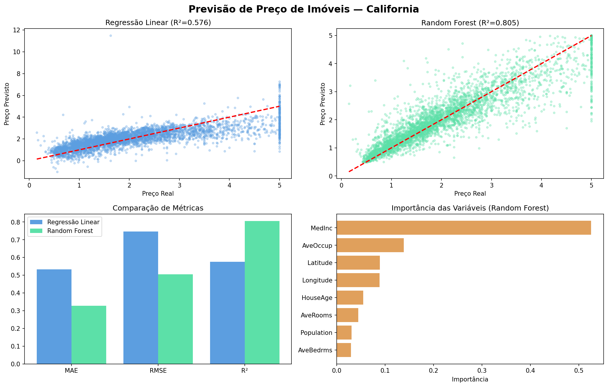

# 🏠 Previsão de Preço de Imóveis — California

Projeto de Machine Learning para prever preços de imóveis na Califórnia, comparando dois modelos — Regressão Linear e Random Forest — com métricas e visualizações completas.

## Como foi feito

Utilizamos o dataset California Housing, disponível diretamente no scikit-learn, com 20.640 registros de imóveis. Após exploração e análise de correlações, dois modelos foram treinados e comparados por métricas de erro e coeficiente de determinação R².

## Base de dados

Dataset California Housing — 20.640 imóveis com 8 variáveis preditoras:

| Variável | Descrição |
|---|---|
| MedInc | Renda mediana da região |
| HouseAge | Idade média das casas |
| AveRooms | Média de cômodos por domicílio |
| AveBedrms | Média de quartos por domicílio |
| Population | População do bloco |
| AveOccup | Média de ocupantes por domicílio |
| Latitude | Latitude geográfica |
| Longitude | Longitude geográfica |

## Resultados

| Modelo | MAE | RMSE | R² |
|---|---|---|---|
| Regressão Linear | 0.533 | 0.746 | 0.576 |
| Random Forest | 0.328 | 0.505 | 0.805 |

O Random Forest explicou **80.5% da variação nos preços**, superando significativamente a Regressão Linear. A variável mais importante foi a renda mediana da região (MedInc).

## Tecnologias

- Python 3
- pandas e NumPy — manipulação dos dados
- scikit-learn — treinamento e avaliação dos modelos
- matplotlib e seaborn — visualizações

## Como rodar

1. Clique no badge **Open in Colab** acima
2. Vá em `Runtime > Run all`
3. O dataset é carregado automaticamente pelo scikit-learn

## Resultado

